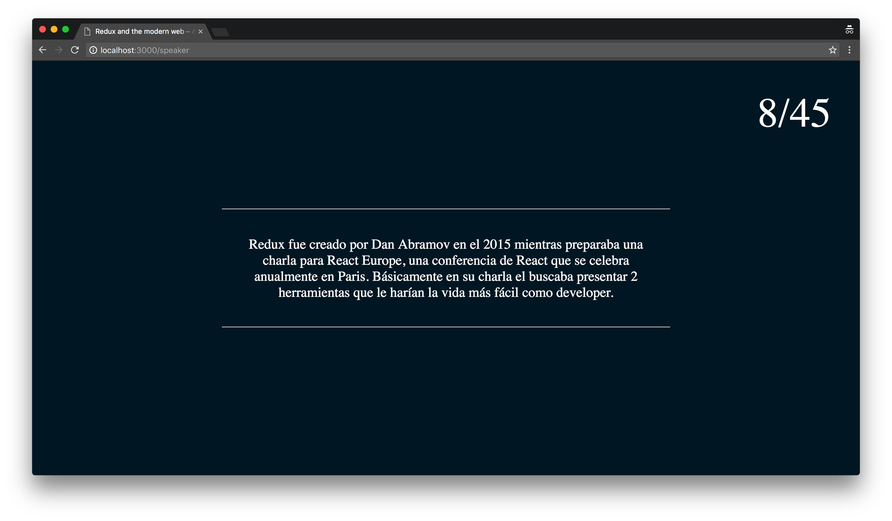

# Redux and the modern web – A love story

#### Español
Esta aplicación sirve de presentación/slides para mi charla sobre Redux, a la vez también sirve de material de ejemplo sobre como se usa. Está hecha completamente en React y Redux.

#### English
This app serve a presentation/slides for my Redux talk and also as an example material on how it's used. It's entirely made with React and Redux.

# Correr la aplicación / Run the app

#### Nota
Para esta parte asumiré que `node` y `npm` ya están instalados.

#### Note
For this part I'll assume that `node` and `npm` are already installed.

### Pasos / Steps
1. Ve al folder principal del proyecto / Go to the project root folder
2. Corre / Run `npm install`
3. Corre / Run `npm start`
4. Ve a `http://localhost:3000` en tu navegador / Go to `http://localhost:3000` in your browser.
5. Voilà

# Modo presentación / Presentation mode

#### Español
Una vez nuestra aplicación esté corriendo, podremos ver los slides en modo presentación en nuestro navegador, via `http://localhost:3000`. Use las flechas de izquierda y derecha para navegar.

#### English
Once our app is runing, we can see the slides in presentation mode in the browser, via `http://localhost:3000`. Use the left and right arrow keys to navigate.

# Modo charlista / Speaker mode

#### Español
En una ventana por separado, puedes ir a `http://localhost:3000/speaker` para activar el modo charlista en tu pantalla. De esta forma podrás llevar control del número de slides en que vas y podrás ver notas para cada slide, lo cual te ayudará a llevar un mejor ritmo de tu presentación. Éste modo se mantendrá siempre sincronizado con el modo Presentación con información relevante solo para el charlista.

#### English
In a separate window, you can go to `http://localhost:3000/speaker` to activate the speaker mode in your screen. This way you can keep control of the number of slides as well as speaker notes for each slide, which will help you to keep your presentation at a better pace. This mode will be synchronized with the Presentation mode with information relevant only to the speaker.

# Como modificar la aplicación / How to modify the app

#### Español
* Toda la información de los slides está en `app/slides.js` como un objeto, en el mismo podemos agregar/remover slides siempre y cuando mantengamos el nombre de cada slide en orden (`slide1`, `slide2`, ..., `slide15`).
* Cada slide tiene una propiedad `type` que será definirá el tipo de slide a mostrar, los tipos disponibles son `simple`, `list`, `image`, `imageList`, `code` y `counter`. Eres bienvenido a implementar nuevos tipos!
* Nuestro componente principal es `app/components/Presentation.jsx`.
* Los componentes encargados de renderizar los diferentes tipos de slide se encuentran en `app/components`.
* Las acciones y reducers de Redux se encuentran en `app/actions` y `app/reducers`, respectivamente.

#### English
* All the slides information are in `app/slides.js` as an object, we can add/remove slides as long as we maintain the names in order (`slide1`, `slide2`, ..., `slide15`).
* Each slide has a `type` property which will define the type of slide to show, the available types are `simple`, `list`, `image`, `imageList`, `code` and `counter`. You are welcome to implement more types!
* Our main component is `app/components/Presentation.jsx`.
* The components in charge of render each slide type are located in `app/components`.
* The Redux actions and reducers are located in `app/actions` and `app/reducers`, respectively.

# Reportar un problema o contactar / Report an issue or contact

#### Español
Por favor agregar un nuevo ticket aquí: https://github.com/kdemoya/barcamp-redux/issues

#### English
Please add a new issue here: https://github.com/kdemoya/barcamp-redux/issues

---

### Feliz aprendizaje! / Happy learning!